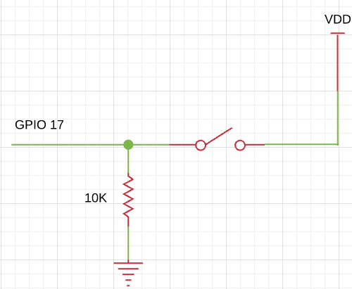

# Elixir Circuits - GPIO

[](https://hex.pm/packages/circuits_gpio)
[](https://hexdocs.pm/circuits_gpio/Circuits.GPIO.html)
[](https://circleci.com/gh/elixir-circuits/circuits_gpio)
[](https://api.reuse.software/info/github.com/elixir-circuits/circuits_gpio)

`Circuits.GPIO` lets you control or read from GPIOs on Nerves or other Linux-based
devices.

If you're coming from Elixir/ALE, check out our [porting guide](PORTING.md).

`Circuits.GPIO` works great with LEDs, buttons, many kinds of sensors, and
simple control of motors. In general, if a device requires high speed
transactions or has hard real-time constraints in its interactions, this is not
the right library. For those devices, see if there's a Linux kernel driver.

## Getting started

If you're natively compiling `circuits_gpio` on a Raspberry Pi or using Nerves,
everything should work like any other Elixir library. Normally, you would
include `circuits_gpio` as a dependency in your `mix.exs` like this:

```elixir
def deps do
  [{:circuits_gpio, "~> 1.0"}]
end
```

One common error on Raspbian is that the Erlang headers are missing (`ie.h`),
you may need to install erlang with `apt-get install erlang-dev` or build Erlang
from source per instructions [here](http://elinux.org/Erlang).

## Examples

`Circuits.GPIO` only supports simple uses of the GPIO interface in Linux, but
you can still do quite a bit. The following examples were tested on a Raspberry
Pi that was connected to an [Erlang Embedded Demo
Board](http://solderpad.com/omerk/erlhwdemo/). There's nothing special about
either the demo board or the Raspberry Pi, so these should work similarly on
other embedded Linux platforms.

## GPIO

A [General Purpose
Input/Output](https://en.wikipedia.org/wiki/General-purpose_input/output) (GPIO)
is just a wire that you can use as an input or an output. It can only be one of
two values, 0 or 1. A 1 corresponds to a logic high voltage like 3.3 V and a 0
corresponds to 0 V. The actual voltage depends on the hardware.

Here's an example of turning an LED on or off:


To turn on the LED that's connected to the net (or wire) labeled `GPIO18`, run
the following:

```elixir
iex> {:ok, gpio} = Circuits.GPIO.open(18, :output)
{:ok, #Reference<...>}

iex> Circuits.GPIO.write(gpio, 1)
:ok

iex> Circuits.GPIO.close(gpio)
:ok
```

_Note that the call to `Circuits.GPIO.close/1` is not necessary, as the garbage
collector will free up any unreferenced GPIOs. It can be used to explicitly
de-allocate connections you know you will not need anymore._

Input works similarly. Here's an example of a button with a pull down resistor
connected.



If you're not familiar with pull up or pull down resistors, they're resistors
whose purpose is to drive a wire high or low when the button isn't pressed. In
this case, it drives the wire low. Many processors have ways of configuring
internal resistors to accomplish the same effect without needing to add an
external resistor. If you're using a Raspberry Pi, you can use [the built-in
pull-up/pull-down resistors](#internal-pull-uppull-down).

The code looks like this in `Circuits.GPIO`:

```elixir
iex> {:ok, gpio} = Circuits.GPIO.open(17, :input)
{:ok, #Reference<...>}

iex> Circuits.GPIO.read(gpio)
0

# Push the button down

iex> Circuits.GPIO.read(gpio)
1
```

If you'd like to get a message when the button is pressed or released, call the
`set_interrupts` function. You can trigger on the `:rising` edge, `:falling` edge
or `:both`.

```elixir
iex> Circuits.GPIO.set_interrupts(gpio, :both)
:ok

iex> flush
{:circuits_gpio, 17, 1233456, 1}
{:circuits_gpio, 17, 1234567, 0}
:ok
```

Note that after calling `set_interrupts`, the calling process will receive an
initial message with the state of the pin. This prevents the race condition
between getting the initial state of the pin and turning on interrupts. Without
it, you could get the state of the pin, it could change states, and then you
could start waiting on it for interrupts. If that happened, you would be out of
sync.

### Internal pull-up/pull-down

To connect or disconnect an internal [pull-up or pull-down resistor](https://github.com/raspberrypilearning/physical-computing-guide/blob/master/pull_up_down.md) to a GPIO
pin, call the `set_pull_mode` function.

```elixir
iex> Circuits.GPIO.set_pull_mode(gpio, pull_mode)
:ok
```

Valid `pull_mode` values are `:none` `:pullup`, or `:pulldown`

Note that `set_pull_mode` is platform dependent, and currently only works for
Raspberry Pi hardware.  Calls to `set_pull_mode` on other platforms will have no
effect.  The internal pull-up resistor value is between 50K and 65K, and the
pull-down is between 50K and 60K.  It is not possible to read back the current
Pull-up/down settings, and GPIO pull-up pull-down resistor connections are
maintained, even when the CPU is powered down.

To get the GPIO pin number for a gpio reference, call the `pin` function.

```elixir
iex> Circuits.GPIO.pin(gpio)
17
```

## Testing

`Circuits.GPIO` supports a "stub" hardware abstraction layer on platforms
without GPIO support and when `MIX_ENV=test`. The stub allows for some
limited unit testing without real hardware.

To use it, first check that you're using the "stub" HAL:

```elixir
iex> Circuits.GPIO.info
%{name: :stub, pins_open: 0}
```

The stub HAL has 64 GPIOs. Each pair of GPIOs is connected. For example,
GPIO 0 is connected to GPIO 1. If you open GPIO 0 as an output and
GPIO 1 as an input, you can write to GPIO 0 and see the result on GPIO 1.
Here's an example:

```elixir
iex> {:ok, gpio0} = Circuits.GPIO.open(0, :output)
{:ok, #Reference<0.801050056.3201171470.249048>}
iex> {:ok, gpio1} = Circuits.GPIO.open(1, :input)
{:ok, #Reference<0.801050056.3201171470.249052>}
iex> Circuits.GPIO.read(gpio1)
0
iex> Circuits.GPIO.write(gpio0, 1)
:ok
iex> Circuits.GPIO.read(gpio1)
1
```

The stub HAL is fairly limited, but it does support interrupts.

If `Circuits.GPIO` is used as a dependency the stub may not be present. To
manually enable it, set `CIRCUITS_MIX_ENV` to `test` and rebuild
`circuits_gpio`.

## FAQ

### How does Circuits.GPIO compare to Elixir/ALE?

`Circuits.GPIO` is almost Elixir/ALE 2.0. The API for Elixir/ALE became
difficult to change so we started again with `Circuits.GPIO`. The main
improvements are:

* Improved performance and lower resource usage
* Timestamps on interrupts
* A hardware abstraction layer to support multiple ways of interfacing with the
  low level GPIO interfaces

See the [Porting Guide](PORTING.md) for more information if you're an Elixir/ALE
user.

### Where can I get help?

Most issues people have are on how to communicate with hardware for the first
time. Since `Circuits.GPIO` is a thin wrapper on the Linux sys class interface,
you may find help by searching for similar issues when using Python or C.

For help specifically with `Circuits.GPIO`, you may also find help on the nerves
channel on the [elixir-lang Slack](https://elixir-slackin.herokuapp.com/).  Many
[Nerves](http://nerves-project.org) users also use `Circuits.GPIO`.

### I tried turning on and off a GPIO as fast as I could. Why was it slow?

Please don't do that - there are so many better ways of accomplishing whatever
you're trying to do:

1. If you're trying to drive a servo or dim an LED, look into PWM. Many
   platforms have PWM hardware and you won't tax your CPU at all. If your
   platform is missing a PWM, several chips are available that take I2C commands
   to drive a PWM output.
2. If you need to implement a wire level protocol to talk to a device, look for
   a Linux kernel driver. It may just be a matter of loading the right kernel
   module.
3. If you want a blinking LED to indicate status, `gpio` really should
   be fast enough to do that, but check out Linux's LED class interface. Linux
   can flash LEDs, trigger off events and more. See [nerves_leds](https://github.com/nerves-project/nerves_leds).

If you're still intent on optimizing GPIO access, you may be interested in
[gpio_twiddler](https://github.com/fhunleth/gpio_twiddler).

### Can I develop code that uses GPIO on my laptop?

See whether the "stub" HAL (described above) works for you or could be improved
to support your use case.

The following advice from Elixir/ALE may also be useful: You'll need to fake out
the hardware. Code to do this depends on what your hardware actually does, but
here's one example:

* [Compiling and testing Elixir Nerves on your host machine](https://cultivatehq.com/posts/compiling-and-testing-elixir-nerves-on-your-host-machine/)

## License

All original source code in this project is licensed under Apache-2.0.

Additionally, this project follows the [REUSE recommendations](https://reuse.software)
and labels so that licensing and copyright are clear at the file level.

Exceptions to Apache-2.0 licensing are:

* Configuration and data files are licensed under CC0-1.0
* Documentation files are CC-BY-4.0
* Erlang Embedded board images are Solderpad Hardware License v0.51.
