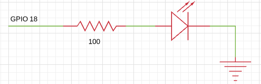

# GPIO - Do not use!!

[](https://circleci.com/gh/ElixirCircuits/gpio)
[](https://hex.pm/packages/gpio)

`gpio` provides high level an abstraction for interfacing to GPIOs
on Linux platforms. Internally, it uses the Linux sysclass interface
so that it does not require platform-dependent code.

`gpio` works great with LEDs, buttons, many kinds of sensors, and simple
control of motors. In general, if a device requires high speed transactions or
has hard real-time constraints in its interactions, this is not the right
library. For those devices, it is recommended to look at other driver options, such
as using a Linux kernel driver.

# Getting started

If you're natively compiling gpio, everything should work like any other
Elixir library. Normally, you would include gpio as a dependency in your
`mix.exs` like this:

```elixir
def deps do
  [{:gpio, "~> 0.1"}]
end
```

If you just want to try it out, you can do the following:

```shell
git clone https://github.com/ElixirCircuits/gpio
cd gpio
mix compile
iex -S mix
```

If you're cross-compiling, you'll need to setup your environment so that the
right C compiler is called. See the `Makefile` for the variables that will need
to be overridden. At a minimum, you will need to set `CROSSCOMPILE`,
`ERL_CFLAGS`, and `ERL_EI_LIBDIR`.

If you're trying to compile on a Raspberry Pi and you get errors indicated that Erlang headers are missing
(`ie.h`), you may need to install erlang with `apt-get install
erlang-dev` or build Erlang from source per instructions [here](http://elinux.org/Erlang).

# Examples

`gpio` only supports simple uses of the GPIO interface in Linux, but you can
still do quite a bit. The following examples were tested on a
Raspberry Pi that was connected to an [Erlang Embedded Demo
Board](http://solderpad.com/omerk/erlhwdemo/). There's nothing special about
either the demo board or the Raspberry Pi, so these should work similarly on
other embedded Linux platforms.

## GPIO

A [General Purpose Input/Output](https://en.wikipedia.org/wiki/General-purpose_input/output) (GPIO)
is just a wire that you can use as an input or an output. It can only be
one of two values, 0 or 1. A 1 corresponds to a logic high voltage like 3.3 V
and a 0 corresponds to 0 V. The actual voltage depends on the hardware.

Here's an example of turning an LED on or off:



To turn on the LED that's connected to the net (or wire) labeled
`GPIO18`, run the following:

```elixir
iex> {:ok, gpio} = GPIO.open(18, :output)
{:ok, #Reference<...>}

iex> GPIO.write(gpio, 1)
:ok
```

Input works similarly. Here's an example of a button with a pull down
resistor connected.


If you're not familiar with pull up or pull down
resistors, they're resistors whose purpose is to drive a wire
high or low when the button isn't pressed. In this case, it drives the
wire low. Many processors have ways of configuring internal resistors
to accomplish the same effect without needing to add an external resistor.
It's platform-dependent and not shown here.

The code looks like this in `gpio`:

```elixir
iex> {:ok, gpio} = GPIO.open(17, :input)
{:ok, #Reference<...>}

iex> GPIO.read(gpio)
0

# Push the button down

iex> GPIO.read(gpio)
1
```

If you'd like to get a message when the button is pressed or released, call the
`set_int` function. You can trigger on the `:rising` edge, `:falling` edge or
`:both`.

```elixir
iex> GPIO.set_int(gpio, :both)
:ok

iex> flush
{:gpio, 17, 1233456, 1}
{:gpio, 17, 1234567, 0}
:ok
```

Note that after calling `set_int`, the calling process will receive an initial
message with the state of the pin. This prevents the race condition between
getting the initial state of the pin and turning on interrupts. Without it,
you could get the state of the pin, it could change states, and then you could
start waiting on it for interrupts. If that happened, you would be out of sync.

## FAQ

### Where can I get help?

Most issues people have are on how to communicate with hardware for the first
time. Since `gpio` is a thin wrapper on the Linux sys class interface, you
may find help by searching for similar issues when using Python or C.

For help specifically with `gpio`, you may also find help on the
nerves channel on the [elixir-lang Slack](https://elixir-slackin.herokuapp.com/).
Many [Nerves](http://nerves-project.org) users also use `gpio`.

### I tried turning on and off a GPIO as fast as I could. Why was it slow?

Please don't do that - there are so many better ways of accomplishing whatever
you're trying to do:

  1. If you're trying to drive a servo or dim an LED, look into PWM. Many
     platforms have PWM hardware and you won't tax your CPU at all. If your
     platform is missing a PWM, several chips are available that take I2C
     commands to drive a PWM output.
  2. If you need to implement a wire level protocol to talk to a device, look
     for a Linux kernel driver. It may just be a matter of loading the right
     kernel module.
  3. If you want a blinking LED to indicate status, `gpio` really should
     be fast enough to do that, but check out Linux's LED class interface. Linux
     can flash LEDs, trigger off events and more. See [nerves_leds](https://github.com/nerves-project/nerves_leds).

If you're still intent on optimizing GPIO access, you may be interested in
[gpio_twiddler](https://github.com/fhunleth/gpio_twiddler).

### Where's PWM support?

On the hardware that I normally use, PWM has been implemented in a
platform-dependent way. For ease of maintenance, `gpio` doesn't have any
platform-dependent code, so supporting it would be difficult. An Elixir PWM
library would be very interesting, though, should anyone want to implement it.

### Can I develop code that uses gpio on my laptop?

You'll need to fake out the hardware. Code to do this depends
on what your hardware actually does, but here's one example:

  * http://www.cultivatehq.com/posts/compiling-and-testing-elixir-nerves-on-your-host-machine/

Please share other examples if you have them.

### Can I help maintain gpio?

Yes! If your life has been improved by `gpio` and you want to give back,
it would be great to have new energy put into this project. Please email me.

